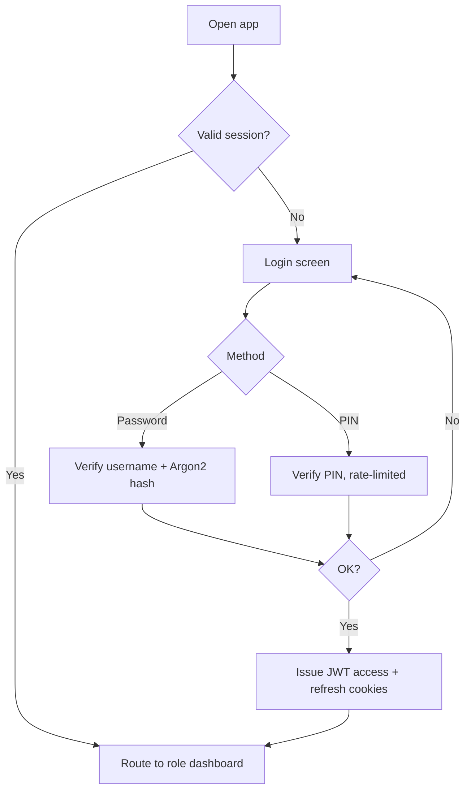
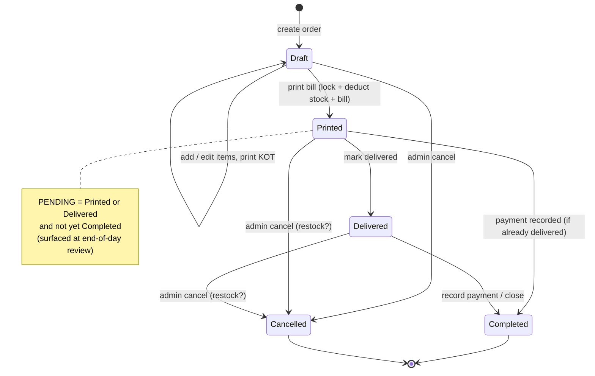
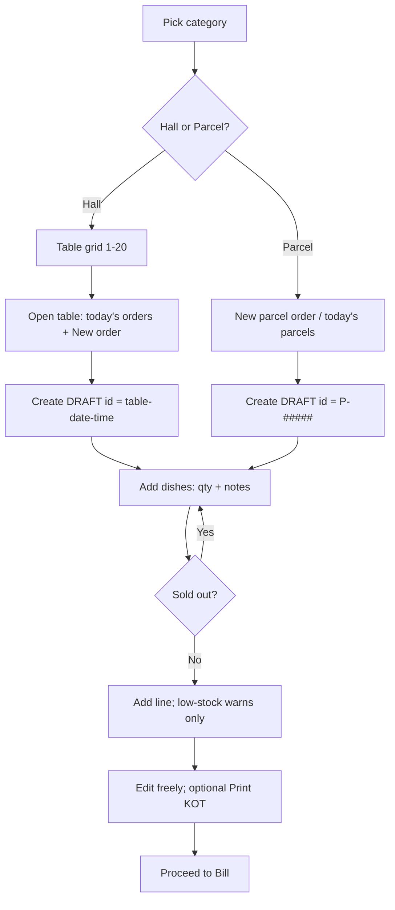
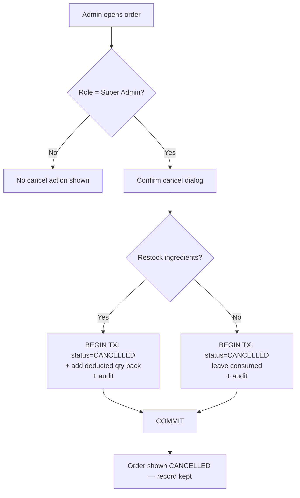
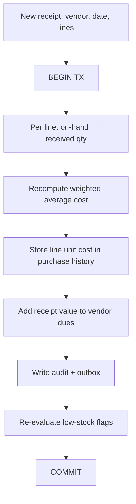
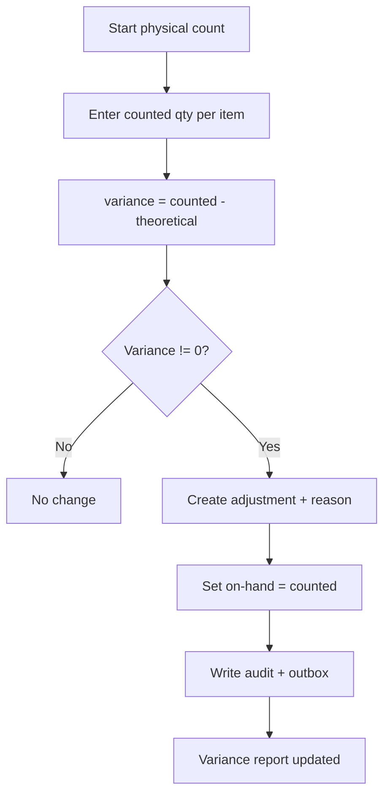
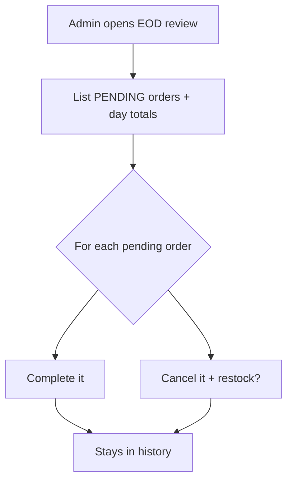
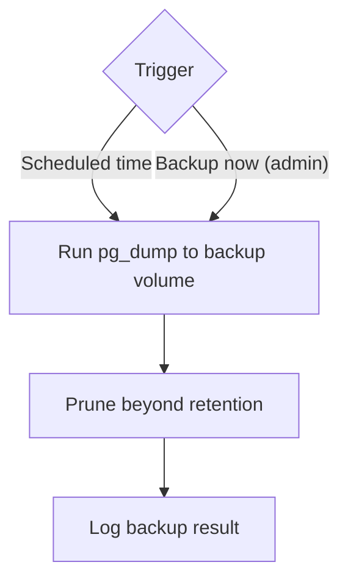

# App Flow Document
### Restaurant Inventory & Sales Management System

| | |
|---|---|
| **Document** | App Flow |
| **Version** | 1.0 (Draft for review) |
| **Status** | Pending sign-off |
| **Builds on** | 01-PRD.md, 02-TRD.md, 03-UI-UX-Design.md |
| **Scope** | v1 end-to-end behavioral flows |
| **Last updated** | 30 May 2026 |

---

## 1. Purpose

This document describes *how the system behaves* end-to-end — the sequences, decisions, and state changes that tie the screens, rules, and data together. Diagrams use Mermaid (renders in most Markdown viewers). Every flow that changes data also writes to the **audit/outbox log** (TRD §9); this is stated once here and assumed throughout.

---

## 2. Authentication & session

### Steps
1. On opening the app, the system checks for a valid session (httpOnly JWT cookie).
2. If valid → route the user to their **role-specific dashboard** and show only permitted navigation.
3. If not → show the Login screen with **Password** and **PIN** tabs.
4. **Password** (all roles): verify username + Argon2 password hash.
5. **PIN** (Sales Managers with PIN enabled): verify the hashed PIN; rate-limited with backoff on repeated failures.
6. On success → issue access + refresh tokens as httpOnly cookies, then route to the dashboard.
7. Access tokens auto-refresh silently; logout clears cookies and server state.
8. Every login, failed attempt, and logout is logged.



---

## 3. Order lifecycle (overview)

### Stored statuses
`DRAFT → PRINTED → DELIVERED → COMPLETED`, plus `CANCELLED` (Super Admin only, terminal).

### Derived classification
- **PENDING** is not a separate stored status. It is any order that is **PRINTED or DELIVERED but not yet COMPLETED and not CANCELLED**. The end-of-day review lists all PENDING orders so the admin can complete or cancel them — this is the "missed / not delivered" case from the requirements.

### Key invariants applied here
- **DRAFT** is the only editable state; KOT may be printed during DRAFT without locking.
- **Bill print** moves DRAFT → PRINTED: it **locks** the order, **deducts stock**, and creates the bill with frozen price/tax snapshots.
- After lock, more items become a **new linked order**, never an edit of the locked one.
- Only **Super Admin** can cancel, and cancelling prompts a **restock yes/no** decision.
- Nothing is ever deleted; status only moves forward or to CANCELLED.



---

## 4. Create & edit an order (counter)

### Steps
1. Sales Manager (or Admin) opens the Counter and picks a category: **Gents Hall**, **Family Hall**, or **Parcel**.
2. **Hall:** the 1–20 table grid appears. Tapping a table opens its workspace showing **today's active orders for that table** plus **New order**. **Parcel:** skip the grid; go straight to a new parcel order or today's parcel orders.
3. On **New order**, the system creates a `DRAFT` with an identifier: halls use `{table}-{date}-{time}`; parcel uses the next **continuous serial** (`P-#####`).
4. The user adds dishes from the menu. Each line captures **quantity** and **optional special instructions**.
   - **Sold-out** dishes are not addable.
   - **Low-stock** dishes are addable but show a non-blocking ⚠ warning.
5. The order is freely editable while `DRAFT`; the running subtotal updates live.
6. **Print KOT** (optional) can be done any time in `DRAFT` to send the kitchen ticket; it does **not** lock the order or deduct stock.
7. Editing continues until the bill is printed.



---

## 5. Bill print (the critical atomic flow)

Moves `DRAFT → PRINTED`. Everything in steps 2–7 happens inside **one database transaction**; the printer is touched only after a successful commit.

### Steps
1. User opens the Billing screen. The **method-independent** parts are computed and shown: subtotal, **discount** (editable only for Super Admin), **service charge** (skipped for Parcel). Because **charges vary by payment method**, the screen also shows a **full itemized breakdown per payment option** (each charge line + grand total, e.g., Cash vs Card/digital).
2. On **Confirm & Print**, the backend begins a transaction and re-checks the order is still `DRAFT` and the version matches (optimistic lock). If stale/already printed → reject with "order changed, reload."
3. Set status `PRINTED` (locked / read-only).
4. Create the **Bill**: freeze the **method-independent** snapshot (line price × qty, subtotal, discount, service charge) and store the **payment options** (one per distinct charge profile — methods with identical rates grouped, e.g., Cash vs Card/digital — each with its charge breakdown + grand total) for the transparent printout. The final GST/charges and grand total are **settled later at payment**.
5. **Deduct stock** for each line: recipe ingredients (converted to each item's stock unit) or one unit of a resale item.
6. Write audit/outbox events; **COMMIT**. (For halls, payment is collected from the guest afterward — see §6/§10.)
7. Render the bill to the configured printer (ESC/POS to network/USB, or PDF for A4) and return success. If printing fails, the bill still exists and is **reprintable**; the UI shows "print failed — retry."

```mermaid
sequenceDiagram
    actor SM as Sales Manager
    participant API as Backend
    participant DB as PostgreSQL
    participant PR as Printer
    SM->>API: POST /orders/{id}/print
    API->>DB: BEGIN TX
    API->>DB: verify DRAFT + version (optimistic lock)
    API->>DB: status = PRINTED (locked)
    API->>DB: create Bill (freeze line snapshots, subtotal, discount, service; store per-method options)
    API->>DB: deduct stock per line (unit-converted)
    API->>DB: write audit + outbox events
    API->>DB: COMMIT
    API->>PR: render & send (ESC/POS or PDF) — itemized per payment option
    API-->>SM: 200 bill printed (reprintable; payment settled later)
```

---

## 6. After lock: new linked order, delivery, completion

### New linked order
If the customer orders more after a bill is printed, the system creates a **new DRAFT order** linked to the same table (and timestamped), billed separately. The original locked order is never reopened.

### Delivery & completion
1. When the food is served/handed over, staff **mark the order Delivered**.
2. When payment is settled (if not already recorded at print), record the **payment**; the order becomes **COMPLETED**.
3. Any printed order not yet completed remains **PENDING** for the end-of-day review.

---

## 7. Cancellation + restock (Super Admin only)

### Steps
1. The **Cancel** action appears only for Super Admin on an order's detail screen.
2. Confirmation dialog explains the record is kept and asks: **Return ingredients to inventory? Yes / No.**
3. In one transaction: verify caller is Super Admin → set status `CANCELLED` → if **Yes**, add the previously deducted quantities back to on-hand stock; if **No**, leave them consumed → write audit → COMMIT.
4. The order remains visible everywhere, marked `CANCELLED`. Nothing is deleted.



---

## 8. Stock receipt (Goods Received) + weighted-average cost

### Steps
1. Inventory Manager/Admin creates a receipt: vendor, date, optional invoice ref, recorded-by, and one or more lines (item, qty, unit, unit cost, line total).
2. In one transaction, for each line: **increase** the item's on-hand quantity and **recompute** its weighted-average cost:
   `new_avg = (on_hand·old_avg + recv_qty·recv_cost) / (on_hand + recv_qty)`
3. Each line's own unit cost is stored for purchase history.
4. The receipt value is added to the **vendor's dues/balance**.
5. **Low-stock flags** are re-evaluated for affected items; COMMIT.



---

## 9. Stock reconciliation, returns, vendor payments

### 9.1 Physical count / adjustment
1. Manager enters the **counted** quantity per item.
2. System computes **variance = counted − theoretical**.
3. If non-zero, create an **adjustment** with a reason (waste / spillage / correction) and set on-hand to the counted value.
4. Feeds the variance/waste report; written to audit.



### 9.2 Stock return to vendor
Record item, quantity, reason, date → reduce on-hand quantity → optionally adjust vendor dues → audit. (No hard delete; it is a recorded movement.)

### 9.3 Vendor payment
Record a payment amount against a vendor → reduce the vendor's outstanding balance → audit. The vendor's dues = total received value − total paid.

---

## 10. Payment recording

- Payment captures a **method** (from the admin-managed list: Cash, Card, Bank, Easypaisa, or custom) and the **amount paid**; change is shown for cash.
- Recording the payment **settles the method-dependent charges**: the chosen method's GST/charge amounts and the **final grand total** are locked onto the bill from the per-method options frozen at print. These settled figures are what all reporting uses.
- For hall orders, this happens **after print** (the waiter collects from the guest); for parcel/counter it may happen at the counter. Once payment is settled, the order can be marked **COMPLETED**.
- No split payments in v1.

---

## 11. End-of-day owner review

### Steps
1. Super Admin opens the end-of-day view (Reports / dashboard).
2. The system lists all **PENDING** orders (printed/delivered but not completed) and the day's totals.
3. For each pending order, the admin can **complete** it (if it was actually fulfilled/paid) or **cancel** it (with the restock decision).
4. Cancelled and completed orders both remain in history; nothing is deleted.



---

## 12. Backups

- **Scheduled:** at the configured time (default nightly), a `pg_dump` writes to the backup volume / external drive; old backups beyond the retention count are pruned.
- **On-demand:** Super Admin triggers **"Backup now"**, producing an immediate dump.
- Both are logged; restore is an operator procedure (TRD §13).



---

## 13. Cross-cutting behaviors

- **Audit/outbox:** every create/edit/print/KOT/reprint/cancel/payment/receipt/adjustment/return/settings/auth event is written immutably (and is the same feed a future sync will replay).
- **Optimistic locking:** concurrent edits to the same draft produce a clear "order changed, reload" message rather than silent overwrites.
- **Unit conversion:** recipe quantities are converted to each item's stock unit at deduction; cross-family conversions are rejected at validation.
- **Warnings vs blocks:** low stock warns; only a manual "sold out" toggle blocks ordering a dish.
- **Localization:** all flows behave identically in English (LTR) and Urdu (RTL).

---

## 14. Resolved decisions

1. **Payment timing.** For hall orders the bill is printed first; the waiter then collects payment from the guest, the payment is recorded, and the order is **completed** after payment. Parcel/counter may pay at the counter. Payment is therefore recorded **after print**, not required at print.
2. **Charges by payment method.** GST and other charges are admin-defined and vary by payment method; the printed bill shows a full itemized breakdown per payment option, and the chosen method settles the final GST/charges and grand total at payment.

No outstanding behavioral questions remain for v1.
