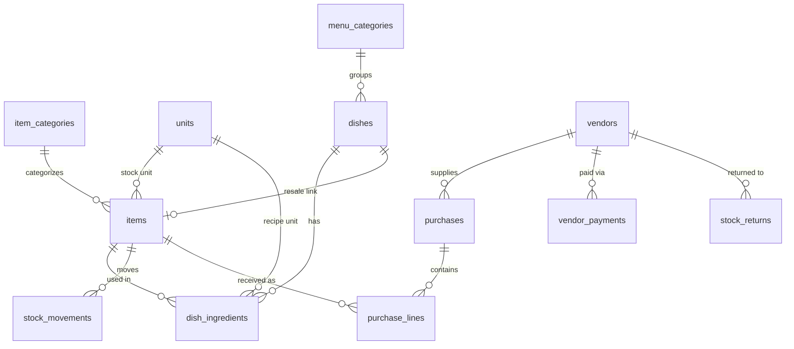
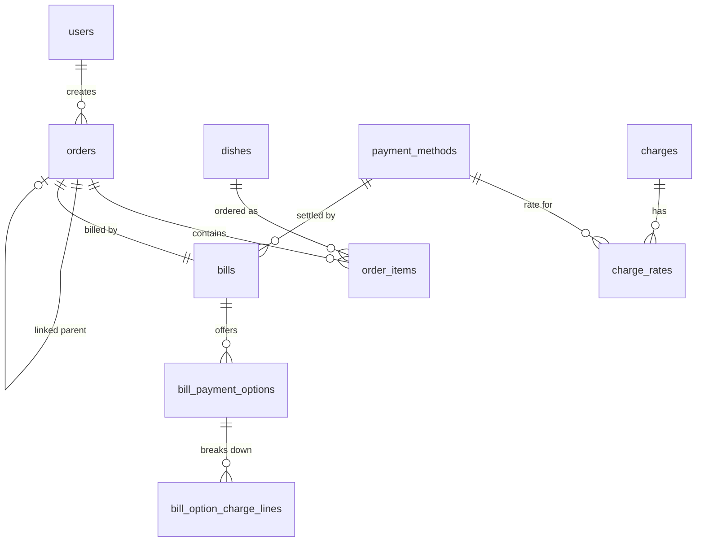

# Backend Schema Document
### Restaurant Inventory & Sales Management System

| | |
|---|---|
| **Document** | Backend Schema |
| **Version** | 1.0 (Draft for review) |
| **Status** | Pending sign-off |
| **Builds on** | 01-PRD.md, 02-TRD.md, 03-UI-UX-Design.md, 04-App-Flow.md |
| **Engine** | PostgreSQL |
| **Last updated** | 30 May 2026 |

---

## 1. Purpose & conventions

This document defines the relational schema: tables, columns, types, relationships, and the invariants the database enforces. It implements the sync-ready, audit-first, never-delete principles from the TRD.

### 1.1 Common columns
Unless a table is marked **append-only**, every table carries these:

| Column | Type | Notes |
|---|---|---|
| `id` | `uuid` (v7) | Primary key. Time-ordered, sync-safe — never auto-increment. |
| `created_at` | `timestamptz` | Set on insert. |
| `updated_at` | `timestamptz` | Set on every update. |
| `created_by` | `uuid` → users | Nullable for system/seed rows. |
| `updated_by` | `uuid` → users | Nullable. |
| `deleted_at` | `timestamptz` | **Soft delete only.** The app never issues hard `DELETE`. |
| `version` | `int` | Optimistic-lock counter; incremented per update. Present on concurrently-edited tables (items, dishes, orders, bills). |

**Append-only tables** (`stock_movements`, `audit_events`, `backups`, and the bill option-line tables) are immutable once written and omit `updated_at`, `deleted_at`, and `version`.

### 1.2 Money & quantity types
- Money: `numeric(12,2)` (PKR).
- Quantities & rates: `numeric(12,3)` for stock quantities, `numeric(6,3)` for percentage rates.

---

## 2. Enumerated types

| Enum | Values |
|---|---|
| `user_role` | `SUPER_ADMIN`, `INVENTORY_MANAGER`, `SALES_MANAGER` |
| `unit_family` | `WEIGHT`, `VOLUME`, `COUNT` |
| `dish_type` | `RECIPE`, `RESALE` |
| `order_category` | `GENTS_HALL`, `FAMILY_HALL`, `PARCEL` |
| `order_status` | `DRAFT`, `PRINTED`, `DELIVERED`, `COMPLETED`, `CANCELLED` |
| `movement_type` | `RECEIPT`, `SALE_DEDUCTION`, `ADJUSTMENT`, `RETURN`, `CANCEL_RESTOCK` |
| `movement_ref_type` | `PURCHASE`, `ORDER`, `COUNT`, `RETURN`, `CANCEL` |
| `charge_kind` | `PERCENTAGE` (future: `FIXED`) |
| `charge_base` | `SUBTOTAL_AFTER_DISCOUNT` (future bases possible) |
| `backup_type` | `SCHEDULED`, `MANUAL` |
| `backup_status` | `RUNNING`, `SUCCESS`, `FAILED` |
| `audit_action` | `CREATE`, `UPDATE`, `KOT`, `PRINT`, `REPRINT`, `CANCEL`, `PAYMENT`, `DELIVER`, `COMPLETE`, `RECEIPT`, `ADJUSTMENT`, `RETURN`, `VENDOR_PAYMENT`, `SETTINGS_CHANGE`, `LOGIN`, `LOGIN_FAILED`, `LOGOUT` |

> Note: `PENDING` is **not** a stored status — it is the derived view of `PRINTED`/`DELIVERED` orders that are not yet `COMPLETED` (App Flow §3).

---

## 3. ER diagrams

### 3.1 Inventory, menu & purchasing

### 3.2 Orders, billing & charges

---

## 4. Identity & access

### 4.1 `users`
| Column | Type | Notes |
|---|---|---|
| `username` | `text` unique | Login handle. |
| `password_hash` | `text` | Argon2. |
| `pin_hash` | `text` null | Optional fast PIN (Sales Managers). |
| `role` | `user_role` | Drives RBAC. |
| `full_name` | `text` | Display name. |
| `active` | `bool` | Deactivated, never deleted. |
| `last_login_at` | `timestamptz` null | |

### 4.2 `refresh_tokens` (append-only-ish; revocable)
| Column | Type | Notes |
|---|---|---|
| `user_id` | `uuid` → users | |
| `token_hash` | `text` | Hashed refresh token. |
| `expires_at` | `timestamptz` | |
| `revoked_at` | `timestamptz` null | Set on logout/rotation. |

---

## 5. Settings (singleton)

### 5.1 `settings` (single row)
| Column | Type | Notes |
|---|---|---|
| `restaurant_name` | `text` | Bill header. |
| `logo_path` | `text` null | Stored in uploads volume. |
| `address` | `text` | Bill header. |
| `phone` | `text` | Bill header. |
| `tax_number` | `text` null | NTN/tax id on bill. |
| `default_language` | `text` | `en` / `ur`. |
| `currency` | `text` | `PKR`. |
| `backup_cron` | `text` | Schedule (default nightly). |
| `backup_retention` | `int` | Keep last N. |
| `printer_config` | `jsonb` | `{ type: a4|thermal, connection: network|usb, ip, port, width }`. |

---

## 6. Inventory

### 6.1 `units` (reference data)
| Column | Type | Notes |
|---|---|---|
| `name` | `text` | kg, g, l, ml, piece, dozen… |
| `family` | `unit_family` | Conversion only within a family. |
| `factor_to_base` | `numeric(18,9)` | Multiplier to the family's base unit (e.g., g→kg = 0.001). |

### 6.2 `item_categories`
| Column | Type | Notes |
|---|---|---|
| `name` | `text` | User-defined. |
| `active` | `bool` | |

### 6.3 `items`
| Column | Type | Notes |
|---|---|---|
| `name` | `text` | |
| `category_id` | `uuid` → item_categories | |
| `stock_unit_id` | `uuid` → units | The unit on-hand is measured in. |
| `qty_on_hand` | `numeric(12,3)` | **Denormalized cache** maintained by `stock_movements` in the same transaction. |
| `avg_cost` | `numeric(12,2)` | Weighted moving average; recomputed on each `RECEIPT`. |
| `reorder_level` | `numeric(12,3)` null | Low-stock threshold. |
| `active` | `bool` | |

Index: `(category_id)`; partial index for low-stock `WHERE qty_on_hand <= reorder_level`.

---

## 7. Menu / dishes

### 7.1 `menu_categories`
| Column | Type | Notes |
|---|---|---|
| `name` | `text` | Optional grouping (Starters, Karahi…). |
| `sort_order` | `int` | |
| `active` | `bool` | |

### 7.2 `dishes`
| Column | Type | Notes |
|---|---|---|
| `name` | `text` | |
| `menu_category_id` | `uuid` → menu_categories null | Optional. |
| `selling_price` | `numeric(12,2)` | Current price; snapshotted onto order lines at print. |
| `type` | `dish_type` | `RECIPE` or `RESALE`. |
| `resale_item_id` | `uuid` → items null | Required when `type=RESALE`; null for `RECIPE`. |
| `available` | `bool` | Manual sold-out toggle. |

Constraint: `type=RESALE` ⇒ `resale_item_id` not null and no `dish_ingredients`; `type=RECIPE` ⇒ `resale_item_id` null.

### 7.3 `dish_ingredients` (recipe lines)
| Column | Type | Notes |
|---|---|---|
| `dish_id` | `uuid` → dishes | |
| `item_id` | `uuid` → items | |
| `quantity` | `numeric(12,3)` | Amount consumed per dish. |
| `unit_id` | `uuid` → units | Must share the item's unit family. |

---

## 8. Vendors & purchasing

### 8.1 `vendors`
| Column | Type | Notes |
|---|---|---|
| `name` | `text` | |
| `contact` | `text` null | |
| `notes` | `text` null | |
| `active` | `bool` | |

### 8.2 `purchases` (goods-received header)
| Column | Type | Notes |
|---|---|---|
| `vendor_id` | `uuid` → vendors | |
| `received_date` | `date` | |
| `invoice_ref` | `text` null | |
| `total_value` | `numeric(12,2)` | Sum of lines; adds to vendor dues. |
| `recorded_by` | `uuid` → users | |

### 8.3 `purchase_lines`
| Column | Type | Notes |
|---|---|---|
| `purchase_id` | `uuid` → purchases | |
| `item_id` | `uuid` → items | |
| `quantity` | `numeric(12,3)` | |
| `unit_id` | `uuid` → units | |
| `unit_cost` | `numeric(12,2)` | Stored for history; drives weighted-average. |
| `line_total` | `numeric(12,2)` | |

### 8.4 `vendor_payments`
| Column | Type | Notes |
|---|---|---|
| `vendor_id` | `uuid` → vendors | |
| `amount` | `numeric(12,2)` | |
| `paid_at` | `timestamptz` | |
| `note` | `text` null | |
| `recorded_by` | `uuid` → users | |

> **Vendor dues** = Σ `purchases.total_value` − Σ `vendor_payments.amount` (− returns credit, if applied).

### 8.5 `stock_returns`
| Column | Type | Notes |
|---|---|---|
| `vendor_id` | `uuid` → vendors null | |
| `item_id` | `uuid` → items | |
| `quantity` | `numeric(12,3)` | |
| `unit_id` | `uuid` → units | |
| `reason` | `text` | |
| `return_date` | `date` | |
| `recorded_by` | `uuid` → users | |

Each return writes a `RETURN` stock movement (reduces on-hand).

---

## 9. Stock ledger & reconciliation

### 9.1 `stock_movements` (append-only ledger)
The canonical record of every change to on-hand quantity. `items.qty_on_hand` is the running cache of these.

| Column | Type | Notes |
|---|---|---|
| `id` | `uuid` | |
| `item_id` | `uuid` → items | |
| `movement_type` | `movement_type` | RECEIPT / SALE_DEDUCTION / ADJUSTMENT / RETURN / CANCEL_RESTOCK. |
| `quantity_delta` | `numeric(12,3)` | Signed (in the item's stock unit). |
| `unit_cost` | `numeric(12,2)` null | For RECEIPT (feeds avg cost). |
| `ref_type` | `movement_ref_type` | PURCHASE / ORDER / COUNT / RETURN / CANCEL. |
| `ref_id` | `uuid` | The source record. |
| `reason` | `text` null | For adjustments. |
| `created_by` | `uuid` → users | |
| `created_at` | `timestamptz` | |

Index: `(item_id, created_at)`, `(ref_type, ref_id)`.

### 9.2 `stock_counts` (header)
| Column | Type | Notes |
|---|---|---|
| `counted_at` | `timestamptz` | |
| `counted_by` | `uuid` → users | |
| `note` | `text` null | |

### 9.3 `stock_count_lines`
| Column | Type | Notes |
|---|---|---|
| `count_id` | `uuid` → stock_counts | |
| `item_id` | `uuid` → items | |
| `system_qty` | `numeric(12,3)` | Theoretical at count time. |
| `counted_qty` | `numeric(12,3)` | Physical. |
| `variance` | `numeric(12,3)` | `counted − system`. |
| `reason` | `text` null | waste / spillage / correction. |

A non-zero variance writes an `ADJUSTMENT` stock movement and updates `qty_on_hand` to the counted value.

---

## 10. Orders

### 10.1 `orders`
| Column | Type | Notes |
|---|---|---|
| `order_number` | `text` unique | Hall: `F12-20260530-1930`; Parcel: `P-00042`. |
| `category` | `order_category` | |
| `table_number` | `int` null | 1–20 for halls; null for parcel. |
| `parcel_serial` | `int` null | From a dedicated **continuous** sequence; null for halls. |
| `status` | `order_status` | DRAFT→PRINTED→DELIVERED→COMPLETED, or CANCELLED. |
| `linked_parent_order_id` | `uuid` → orders null | Set when this is a new order added after a locked bill. |
| `printed_at` | `timestamptz` null | |
| `delivered_at` | `timestamptz` null | |
| `completed_at` | `timestamptz` null | |
| `cancelled_at` | `timestamptz` null | |
| `cancelled_by` | `uuid` → users null | Super Admin only. |
| `cancel_restocked` | `bool` null | The restock decision at cancel. |

Index: `(status)`, `(category, table_number)`, `(created_at)`, `(linked_parent_order_id)`.
A dedicated DB sequence `parcel_serial_seq` guarantees continuous parcel numbering.

### 10.2 `order_items`
| Column | Type | Notes |
|---|---|---|
| `order_id` | `uuid` → orders | |
| `dish_id` | `uuid` → dishes | |
| `dish_name_snapshot` | `text` | Frozen name at print. |
| `quantity` | `int` | |
| `unit_price_snapshot` | `numeric(12,2)` | Frozen dish price at print. |
| `line_total_snapshot` | `numeric(12,2)` | `qty × unit_price`. |
| `special_instructions` | `text` null | Optional (spice level, etc.). |

Snapshots are set when the bill is printed, freezing prices against later menu changes.

---

## 11. Billing & charges

### 11.1 `payment_methods`
| Column | Type | Notes |
|---|---|---|
| `name` | `text` | Cash, Card, Bank, Easypaisa, custom. |
| `sort_order` | `int` | |
| `active` | `bool` | |

### 11.2 `charges`
| Column | Type | Notes |
|---|---|---|
| `name` | `text` | GST, Service Charge, … |
| `charge_kind` | `charge_kind` | PERCENTAGE in v1. |
| `base` | `charge_base` | SUBTOTAL_AFTER_DISCOUNT. |
| `applies_to_categories` | `order_category[]` | e.g., service charge = {GENTS_HALL, FAMILY_HALL}; GST = all three. |
| `sort_order` | `int` | Display order on the bill. |
| `active` | `bool` | |

### 11.3 `charge_rates`
| Column | Type | Notes |
|---|---|---|
| `charge_id` | `uuid` → charges | |
| `payment_method_id` | `uuid` → payment_methods **null** | **Null = default rate for all methods.** A method-specific row overrides it. |
| `rate_percent` | `numeric(6,3)` | e.g., GST = 16 (Cash), 5 (Card). |

Unique `(charge_id, payment_method_id)`. **Resolution:** for a given charge + method, use the method-specific rate if present, else the null-method default.

### 11.4 `bills`
| Column | Type | Notes |
|---|---|---|
| `order_id` | `uuid` → orders unique | 1:1 with the locked order. |
| `bill_number` | `text` | Mirrors order number (or own series). |
| `subtotal` | `numeric(12,2)` | **Frozen at print.** |
| `discount` | `numeric(12,2)` | Frozen at print; Super-Admin only. |
| `discount_by` | `uuid` → users null | Who applied it. |
| `printed_at` | `timestamptz` | |
| `printed_by` | `uuid` → users | |
| `reprint_count` | `int` | Incremented on each reprint (logged). |
| `settled` | `bool` | True once payment recorded. |
| `settled_payment_method_id` | `uuid` → payment_methods null | The chosen method. |
| `settled_total` | `numeric(12,2)` null | Final grand total for that method. |
| `amount_paid` | `numeric(12,2)` null | |
| `change_given` | `numeric(12,2)` null | For cash. |
| `settled_at` | `timestamptz` null | |
| `settled_by` | `uuid` → users null | |

### 11.5 `bill_payment_options` (append-only; frozen at print)
One row per **distinct charge profile** — payment methods that resolve to identical charge rates are grouped into a single option (e.g., "Card / Digital" when Card, Bank, and Easypaisa share rates). This matches what is printed and avoids redundant rows, as common POS systems do.

| Column | Type | Notes |
|---|---|---|
| `bill_id` | `uuid` → bills | |
| `label` | `text` | Display label, e.g., "Cash", "Card / Digital". |
| `member_method_ids` | `uuid[]` | Payment methods covered by this option (snapshot). |
| `charges_total` | `numeric(12,2)` | Sum of this option's charge lines. |
| `grand_total` | `numeric(12,2)` | `subtotal − discount + charges_total`. |

### 11.6 `bill_option_charge_lines` (append-only)
The itemized breakdown for each option (full transparency + tax reporting).

| Column | Type | Notes |
|---|---|---|
| `option_id` | `uuid` → bill_payment_options | |
| `charge_id` | `uuid` → charges null | Null-safe if charge later deactivated. |
| `charge_name_snapshot` | `text` | e.g., "GST". |
| `rate_percent` | `numeric(6,3)` | Frozen rate. |
| `amount` | `numeric(12,2)` | Computed on the frozen base. |

> Method-independent charges (e.g., service charge) appear identically across every option; method-dependent charges (e.g., GST) differ. **Settled figures** are read from the chosen option (the `bill_payment_options` row whose `member_method_ids` contains `bills.settled_payment_method_id`), so tax reports aggregate that option's `bill_option_charge_lines`.

---

## 12. Audit & sync feed

### 12.1 `audit_events` (append-only — audit log + sync outbox)
| Column | Type | Notes |
|---|---|---|
| `id` | `uuid` | |
| `seq` | `bigserial` | Monotonic order for replay/replication. |
| `entity_type` | `text` | e.g., `order`, `item`, `bill`. |
| `entity_id` | `uuid` | |
| `action` | `audit_action` | |
| `actor_id` | `uuid` → users null | Null for system actions. |
| `before` | `jsonb` null | Prior state (for updates). |
| `after` | `jsonb` null | New state. |
| `summary` | `text` | Human-readable line. |
| `created_at` | `timestamptz` | |
| `synced_at` | `timestamptz` null | Unused in v1; the hook for v2 sync. |

Index: `(entity_type, entity_id)`, `(created_at)`, `(seq)`.
Immutable: no update/delete paths — this is what makes it tamper-evident and replay-safe.

---

## 13. Backups

### 13.1 `backups` (append-only log)
| Column | Type | Notes |
|---|---|---|
| `file_path` | `text` | Location in backup volume. |
| `type` | `backup_type` | SCHEDULED / MANUAL. |
| `status` | `backup_status` | RUNNING / SUCCESS / FAILED. |
| `size_bytes` | `bigint` null | |
| `started_at` | `timestamptz` | |
| `finished_at` | `timestamptz` null | |
| `triggered_by` | `uuid` → users null | Null for scheduled. |

---

## 14. Maintained invariants (enforced in transactions)

1. **`qty_on_hand`** always equals the sum of that item's `stock_movements`; both update in one transaction.
2. **`avg_cost`** recomputed only on `RECEIPT`:
   `new = (qty_on_hand·old_avg + recv_qty·recv_cost) / (qty_on_hand + recv_qty)`.
3. **Bill print** (one transaction): lock order → freeze `bills` method-independent fields + `order_items` snapshots → compute `bill_payment_options` + `bill_option_charge_lines` per **distinct charge profile** (grouping methods with identical resolved rates) → write `SALE_DEDUCTION` movements → audit.
4. **Payment** settles `bills.settled_*` from the chosen option; order may then be `COMPLETED`.
5. **Cancellation** (Super Admin): set `CANCELLED`; if restock chosen, write `CANCEL_RESTOCK` movements; audit. Never deletes.
6. **Charge resolution** per (charge, method): method-specific `charge_rates` row else null-method default; only charges whose `applies_to_categories` includes the order's category are applied.
7. **No hard deletes**; `deleted_at` / status only. Append-only tables are immutable.
8. **Optimistic locking** via `version` on orders/items/dishes/bills prevents concurrent overwrites.

---

## 15. Resolved decisions

1. **Bill payment options** are stored **one row per distinct charge profile**, grouping payment methods that resolve to identical rates (e.g., "Card / Digital") — matching the printed bill and avoiding redundant rows, as common POS systems do.
2. **Returns** stay modeled as one item per return.
3. **Bill numbering** mirrors the order number (no separate bill series).

No outstanding schema questions remain for v1.
